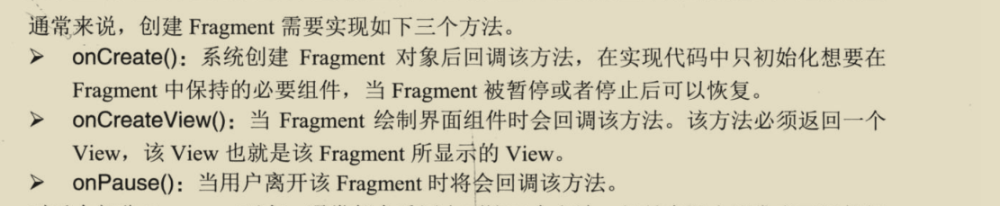

## Android 实验四- Fragment

### 1.静态添加Fragment
1. 在活动`activity`布局文件中添加 `fragment` 组件，**必须得有 id 属性**，同时**得有name 属性**，指明具体对应的`Fragment`（继承 `Fragment`的类)
	```
	    <fragment
	    android:id="@+id/left_frag" android:name="com.example.ethanwalker.fragmentcheck.LeftFragment"
										                  
	```
2. 创建 `fragment` 的布局 例如 `left_fragment.xml`
3. 在`LeftFragment`类中的`onCreateView`方法中加载该布局`left_fragment.xml`

```
public View onCreateView(LayoutInflater inflater, @Nullable ViewGroup container, @Nullable Bundle savedInstanceState) {
    View view = inflater.inflate(R.layout.left_fragment,container,false);
    return view;
}
```


### 2. 动态添加 Fragemnt
1. 创建三个Fragment子类对象，及其layout 布局，在子类对象中 重写 onCreateView 方法，加载 各自对应的布局

```
public class LeftFragment extends Fragment {
    @Nullable
    @Override
    public View onCreateView(LayoutInflater inflater, @Nullable ViewGroup container, @Nullable Bundle savedInstanceState) {
        View view =inflater.inflate(R.layout.left_fragment,container,false);
        return view;

    }
}
```
2. 在主活动 的布局文件中，添加fragement 和 一个 FrameLayout 组件
```
  <fragment
        android:id="@+id/left_fragment"
        android:name="com.example.ethanwalker.fragmentdemo.LeftFragment"
        android:layout_weight="1"
        android:layout_width="0dp"
        android:layout_height="match_parent"/>
    <FrameLayout
        android:id="@+id/right_layout"
        android:layout_weight="3"
        android:layout_width="0dp"
        android:layout_height="match_parent">
```

3. 在主活动中动态添加碎片

```
创建要替换的Fragment子类对象，传入

private void replaceFragment(Fragment fragment){
    // 创建 FragmentManager对象
    FragmentManager fragmentManager = getSupportFragmentManager();
    
    // 创建 FragmentTransaction 事务对象
    FragmentTransaction transaction = fragmentManager.beginTransaction();
    
    // 替换 fragment 对象, 传入容器（FrameLayout）的id ，和要替换的Fragment对象
    transaction.replace(R.id.right_layout,fragment);
    //将事务添加到返回栈中，点击返回，返回到上一个碎片
        transaction.addToBackStack(null);
        
    // 提交事务
    transaction.commit();

}
```

**android:ellipsize='end'** ellipsize设定当文本内容超过控件宽度时，文本的省略方式，end 表示	在尾部进行省略


### 2.  奇淫技巧
1.  `getFragmentManager`  `getSupportFragmentManager`
	当导入的是 support.v4下的Fragment，使用 getSupportFragmentManager，
否则使用getFragmentManager


2. `fragment`、`activity`之间的通信
- `activity`中获取`fragment` : `getSupportFragmentManager().findFragmentById()`
	
- `fragment`中获取`activity`:
		 `getActivity()`， 然后就可以调用活动中的方法
- `fragment`中获取`fragment`:  `getActivity().getSupportFragmentManager().findFragmentById`
		
3. 如果一个fragment是被静态附着在activity上，该fragment对应的 布局中的空间可以被activity直接获取，但如果是动态导入，activity就不能获取其内的控件。


