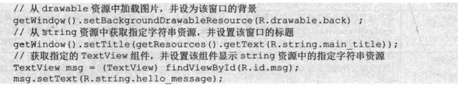
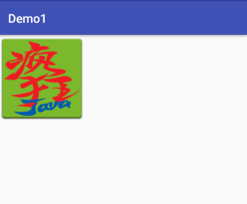
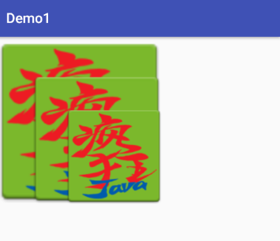
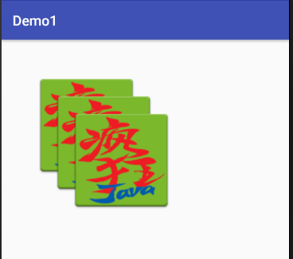

#Android实验六--Drawable


## Drawable对象
### StateListDrawable
### LayerDrawable
语法


```
<?xml version="1.0" encoding="utf-8"?>
<layer-list
    xmlns:android="http://schemas.android.com/apk/res/android" >
    <item
        android:drawable="@[package:]drawable/drawable_resource"
        android:id="@[+][package:]id/resource_name"
        android:top="dimension"
        android:right="dimension"
        android:bottom="dimension"
        android:left="dimension" />
</layer-list>
```

1.  默认情况下，所有可绘制项都会缩放以适应包含视图的大小。因此，将图像放在图层列表中的不同位置可能会增大视图的大小，并且有些图像会相应地缩放。为避免缩放列表中的项目，请在 <item> 元素内使用 <bitmap> 元素指定可绘制对象，并且对某些不缩放的项目（例如 "center"）定义重力。例如，以下 <item> 定义缩放以适应其容器视图的项目：

```
	<item android:drawable="@drawable/layer_drawable" />
```


2.  定义偏移也会导致图像大小改变

```
	<layer-list xmlns:android="http://schemas.android.com/apk/res/android">
    <item android:drawable="@drawable/ic" />
    <item
        android:drawable="@drawable/ic"
        android:left="50dp"
        android:top="50dp" />
    <item
        android:drawable="@drawable/ic"
        android:left="100dp"
        android:top="100dp" />
</layer-list>
```
定义偏移的drawable对象撑开了容器组件，导致未定义偏移的drawable也要进行缩放



3. 为避免缩放，以下示例使用重力居中的 <bitmap> 元素：

```
<item>
  <bitmap android:src="@drawable/image"
          android:gravity="center" />
</item>
```
示例：
```
<layer-list xmlns:android="http://schemas.android.com/apk/res/android">
    <item>
        <bitmap
            android:gravity="center"
            android:src="@drawable/ic" />
    </item>
    <item

        android:left="50dp"
        android:top="50dp">
        <bitmap
            android:gravity="center"
            android:src="@drawable/ic" />
    </item>

    <item
        android:left="100dp"
        android:top="100dp">
        <bitmap
            android:gravity="center"
            android:src="@drawable/ic" />
    </item>
</layer-list>
```



--------

### LevelListDrawable
管理大量备选可绘制对象的可绘制对象，每个可绘制对象都分配有最大的备选数量。使用 setLevel()/ setImageLevel 设置可绘制对象的级别值会加载级别列表中 android:maxLevel 值大于或等于传递到方法的值的可绘制对象资源。

语法：

```
<level-list xmlns:android="http://schemas.android.com/apk/res/android">
    <item
        android:drawable="@drawable/ic"
        android:maxLevel="2"
        android:minLevel="1" />
    <item
        android:drawable="@drawable/a"
        android:maxLevel="4"
        android:minLevel="3" />
</level-list>
```

在程序中设置等级

```
ImageView imageView = (ImageView)findViewById(R.id.img);
imageView.setImageLevel(4);
```
当满足minLevel<= setLevel<=maxLevel 时，该item 显示； 如果列表中多个匹配，优先显示第一个

--------

### TransitionDrawable
`TransitionDrawable` 是可在两种可绘制对象资源之间交错淡出的可绘制对象。

每个可绘制对象由单一 <transition> 元素内的 <item> 元素表示。不支持超过两个项目。要向前转换，请调用 startTransition()。要向后转换，则调用 reverseTransition()。

res/drawable/ transition_demo.xml
```
<transition xmlns:android="http://schemas.android.com/apk/res/android">
    <item android:drawable="@drawable/ic" />
    <item android:drawable="@drawable/ic1" />
</transition>
```
在控件中添加该drawable 引用
```
<ImageButton
    android:id="@+id/img"
    android:src="@drawable/transition_drawable"
    android:layout_width="wrap_content"
    android:layout_height="wrap_content" />
```
设置点击一次， 来回切换按钮图片
```

        final ImageButton imageButton = (ImageButton) findViewById(R.id.img);
        imageButton.setOnClickListener(new View.OnClickListener() {
            int t=0;
            @Override
            public void onClick(View v) {
                TransitionDrawable td= (TransitionDrawable) imageButton.getDrawable();
                t++;
                if(t%2==1){

                    td.startTransition(1000);
                }else{
                    td.reverseTransition(1000);
                }
            }
        });
```

### InsetDrawable 
A Drawable that insets another Drawable by a specified distance. This is used when a View needs a background that is smaller than the View's actual bounds.

例：
定义InsetDrawable  对象

```
<?xml version="1.0" encoding="utf-8"?>
<inset xmlns:android="http://schemas.android.com/apk/res/android"
    android:drawable="@drawable/background"
    android:insetTop="10dp"
    android:insetLeft="10dp" />
```

定义控件引用该 InsetDrawable 对象

```
<TextView
    android:id="@+id/text"
    android:background="@drawable/inset_drawable"
    android:layout_width="match_parent"
    android:layout_height="250dp" />
```

上面设置了TextView的 宽度，高度，默认背景图片会进行缩放来保持和控件的宽高一致，当希望背景图片大小小于控件的大小时，通过设置  `<inset>` 标签内的`insetTop`、`insetLeft`来设置 背景图片和 控件四边的距离


### ClipDrawable 
在 XML 文件中定义的对其他可绘制对象进行裁剪（根据其当前级别）的可绘制对象。
语法
```
<?xml version="1.0" encoding="utf-8"?>
<clip
    xmlns:android="http://schemas.android.com/apk/res/android"
    android:drawable="@drawable/drawable_resource"
    android:clipOrientation=["horizontal" | "vertical"]
    android:gravity=["top" | "bottom" | "left" | "right" | "center_vertical" |
                     "fill_vertical" | "center_horizontal" | "fill_horizontal" |
                     "center" | "fill" | "clip_vertical" | "clip_horizontal"] />
```

android:clipOrientation
关键字。裁剪方向。  表明从水平方向还是竖直方向裁剪

android:gravity
关键字。指定可绘制对象中要裁剪的位置。
- top	将对象放在其容器顶部，不改变其大小。当 clipOrientation 是 "vertical" 时，在可绘制对象的底部裁剪。
- left	将对象放在其容器左边缘，不改变其大小。这是默认值。当 clipOrientation 是 "horizontal" 时，在可绘制对象的右边裁剪。这是默认值。
- center	/ center_vertical  / center_horizontal 将对象放在其容器的水平和垂直轴中心，不改变其大小。当 `clipOrientation` 是 "horizontal" 时，在左边和右边裁剪。当 clipOrientation 是 "vertical" 时，在顶部和底部裁剪。

**裁剪水平**
值从0~10000 ， 默认值是0，表示全部裁剪，10000 表示不裁剪，0~10000 裁剪程度越来越低

在java程序中 获取 控件的 drawable对象，然后通过 getLevel和 setLevel 获得或者设置 裁剪水平

示例： 实现图片向两边展开
定义ClipDrawable 对象
```
<clip xmlns:android="http://schemas.android.com/apk/res/android"
    android:clipOrientation="horizontal"
    android:drawable="@drawable/a"
    android:gravity="center" />
```
设置ImageView ，引用
```
<ImageView
    android:id="@+id/img"
    android:layout_width="wrap_content"
    android:layout_height="wrap_content"

    android:src="@drawable/clip_drawable"/>
```
主程序
```

ImageView img = (ImageView)findViewById(R.id.img);
        img.setImageLevel(0);
        final ClipDrawable clip = (ClipDrawable)img.getDrawable();

        final Handler handler = new Handler(){
            @Override
            public void handleMessage(Message msg) {
                if(msg.what==0x110){
                    clip.setLevel(clip.getLevel()+100);
                }
            }
        };

        final Timer timer = new Timer();
        timer.schedule(new TimerTask() {
            @Override
            public void run() {
                Message message = new Message();
                message.what = 0x110;
                handler.sendMessage(message);
                if(clip.getLevel()>=10000){
                    timer.cancel();
                }
            }
        },0,40);
```
------------

