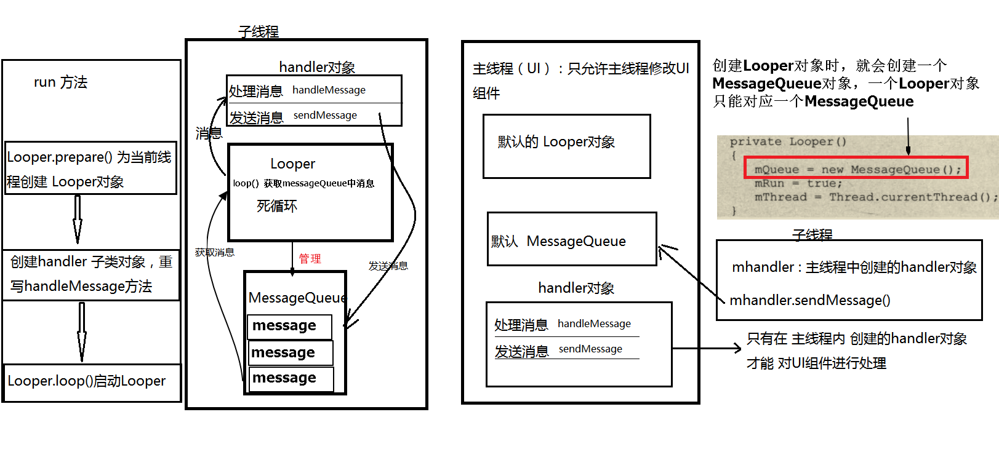

## Android 事件处理
### 1. 阅读资料了解android事件处理机制
Android包括两大事件处理机制： 基于监听的事件处理机制和 基于回调的事件处理机制。
监听：**委托式**，为Android界面组件绑定特定的事件监听器。
例如：

```java
Button button = (Button)findViewById(R.id.but);    // 组件

// 注册事件监听器，绑定对应的 事件
button.setOnClickListener(new View.OnClickListener() {
            @Override
            public boolean onClick(View v) {
            }
});
```

回调： **事件源和事件监听器是统一的，当在某个组件触发某个事件时，组件自身的方法负责处理该事件。**Android 为绝大部分组件提供了事件响应的回调方法，我们需要继承这些组件类，重写这些方法即可。

### 2. 了解基于监听的事件处理模型，编程实现事件和事件监听器
事件源（各个组件）生成事件对象，事件对象触发事件监听器，事件监听器根据不同的事件对象调用不同的事件处理器（方法）进行处理。


#### （1） 利用监听按钮 实现打开电话拨号器 的功能

```java
 
    Intent intent = new Intent();
    intent.setAction(Intent.ACTION_DIAL);
    intent.setData(Uri.parse("tel:13186095182"));
    startActivity(intent);
                
```

 
#### （2）监听事件，实现控制飞机

```java
PlaneView.java
public class PlaneView extends View {
    public float currentX;
    public float currentY;
    Bitmap plane;
    public PlaneView(Context context){
        super(context);
        // 通过BitmapFactory，返回对应图片的Bitmap对象
        plane = BitmapFactory.decodeResource(context.getResources(),R.drawable.plane);
        // 设置当前PlaneView 对象 可获取焦点
        setFocusable(true);
    }

    @Override
    protected void onDraw(Canvas canvas) {
        super.onDraw(canvas);

        //创建画笔
        Paint paint = new Paint();
        // 绘制飞机
        canvas.drawBitmap(plane,currentX,currentY,paint);
    }
}

```

``` java
Plane.java
public class Plane extends AppCompatActivity {
    private int speed = 10;

    @Override
    protected void onCreate(Bundle savedInstanceState) {
        super.onCreate(savedInstanceState);
        //去掉窗口标题
        requestWindowFeature(Window.FEATURE_NO_TITLE);

        // 全屏显示
        getWindow().setFlags(WindowManager.LayoutParams.FLAG_FULLSCREEN, WindowManager.LayoutParams.FLAG_FULLSCREEN);

        //创建PlaneView 组件
        final PlaneView planeView = new PlaneView(this);
        setContentView(planeView);
        planeView.setBackgroundResource(R.drawable.back);

        //获取窗口管理器
        WindowManager windowManager = getWindowManager();

        // 通过窗口管理器获得 默认的Display 对象
        Display display = windowManager.getDefaultDisplay();

        // 创建 DisplayMetrics （窗口度量）对象
        DisplayMetrics metrics = new DisplayMetrics();

        // 获取当前屏幕的尺寸和像素密度，保存到 metrics 对象中
        display.getMetrics(metrics);

        // 设置飞机的起始位置
        planeView.currentX = metrics.widthPixels / 2;
        planeView.currentY = metrics.heightPixels / 2;

        //为PlaneView组件的键盘事件 绑定监听器
        planeView.setOnKeyListener(new View.OnKeyListener() {
            @Override
            public boolean onKey(View v, int keyCode, KeyEvent event) {
                //对不同的按键设置不同的响应事件
                switch (event.getKeyCode()) {
                    case KeyEvent.KEYCODE_S:
                        planeView.currentY += speed; // 向下移
                        break;
                    case KeyEvent.KEYCODE_W:
                        planeView.currentY -= speed;
                        break;
                    case KeyEvent.KEYCODE_A:
                        planeView.currentX -= speed;
                        break;
                    case KeyEvent.KEYCODE_D:
                        planeView.currentX += speed;
                        break;
                }
                // 通知 PlaneView对象进行重绘,invalidate 使无效，作废
                planeView.invalidate();
                return true;
            }
        });

        // 绑定触摸事件
        planeView.setOnTouchListener(new View.OnTouchListener() {
            @Override
            public boolean onTouch(View v, MotionEvent event) {
                planeView.currentX = event.getX();
                planeView.currentY = event.getY();
                planeView.invalidate();
                return true;
            }

        });
    }
}

```


### 基于回调的事件处理机制
回调： **事件源和事件监听器是统一的，当在某个组件触发某个事件时，组件自身的方法负责处理该事件。**Android 为绝大部分组件提供了事件响应的回调方法，我们需要继承这些组件类，重写这些方法即可。

#### 1.自定义组件，重写不同事件的对应的响应方法

```java
public class MyButton extends Button {
    public MyButton(Context context, AttributeSet attrs) {
        super(context, attrs);
    }
    @Override
    public void setOnClickListener(@Nullable OnClickListener l) {
        super.setOnClickListener(l);
    }
    @Override
    public boolean onKeyDown(int keyCode, KeyEvent event) {
        int code = event.getKeyCode();
        Log.e("按下的键==> ",String.valueOf(code));
        // true 表示事件不会向外扩散
        return true;
    }
    @Override
    public boolean onTouchEvent(MotionEvent event) {
        super.onTouchEvent(event);
        Log.e("触摸==>","onTouchEvent方法被调用");
        return true;
    }

}
```
#### 2. 在布局文件中添加自定义的组件，注意是完整的包名

```
<com.example.ethanwalker.demo.MyButton
    android:layout_width="match_parent"
    android:layout_height="wrap_content"
    android:text="单击"
    />
```

**当触发对应的组件事件后，就会回调组件 中我们重写的响应方法**

#### 3. 基于回调的 事件传播
每个回调事件都会返回一个 boolean 值
- true, 表明 该处理方法已经处理完，该事件不会向外扩散。
- false， 表明该处理方法未处理完，事件不会向外扩散。
	如果是false，则如果该组件所在的 外部组件 也设置了 对应事件的处理方法，则也会 响应。响应次序为 **由内向外**
**注意：不仅仅View 的子类可以重写各种事件的响应方法，在Activity 的子类中 也能重写各种事件的响应方法**
	
	例：上面的自定义`MyButton` 组件所在的`Activity`类 也设置了 对应的 `onKeyDown` 响应事件，且 `MyButton` 中的 `onKeyDown` 返回`false`，即允许事件扩散
	
```java
    public class MainActivity extends AppCompatActivity  implements View.OnClickListener{

    @Override
    protected void onCreate(Bundle savedInstanceState) {
        super.onCreate(savedInstanceState);
        setContentView(R.layout.activity_main);
    }
    @Override
    public boolean onKeyDown(int keyCode, KeyEvent event) {
        Log.e("activity 按键按下的响应事件",String.valueOf(event.getKeyCode()));
        return true;
    }

}
```
#### 4. View 子类可当成一个组件放在其他的布局文件内部。
案例:通过回调 实现跟随触摸位置的小球

##### DrawView .java

```java
public class DrawView extends View {
    public float currentX=40;
    public float currentY=50;
    public DrawView(Context context, AttributeSet set){
        super(context,set);
    }
    @Override
    protected void onDraw(Canvas canvas) {
        super.onDraw(canvas);
        // 创建画笔
        Paint paint = new Paint();
        //设置画笔颜色
        paint.setColor(Color.RED);
        //绘制小球
        canvas.drawCircle(currentX,currentY,15,paint);
    }
    @Override
    public boolean onTouchEvent(MotionEvent event) {
        // 获取 触摸的坐标
        currentX = event.getX();
        currentY = event.getY();
        //通知当前对象组件 重绘
        this.invalidate();
        return true;
    }
}
```
##### 在其他布局文件中加上 自定义view组件
   

```xml
<com.example.ethanwalker.demo.DrawView
        android:orientation="vertical"
        android:layout_width="match_parent"
        android:layout_height="match_parent"
        />
```

##### View中的 onDraw 方法，在每次调用`invalidate()`方法后都会执行

#### 5. 响应系统设置更改 `Configuration`
##### 获取`Configuration`对象
通过 `Activity`中的 `getResources() `获取 `Resources`对象，再通过 `getConfiguration` 获得 `Configuration` 对象

```java
  Configuration conf = getResources().getConfiguration();
```


##### 获取屏幕状态

`Configuration` 中的 私有变量
- ` int oritention` 屏幕的 方向
- ` int navigation` 支持的方向导航
- `int touchscreen`  支持的触摸类型 

```
String oritention = ((conf.orientation == Configuration.ORIENTATION_LANDSCAPE) ? "横向屏幕" : "竖向屏幕");
                String touchScreen = ((conf.touchscreen == Configuration.TOUCHSCREEN_NOTOUCH)?"没有触摸屏":"支持触摸屏");
                String naviname = ((conf.navigation == Configuration.NAVIGATION_NONAV?"没有导航":(conf.navigation == conf.NAVIGATION_TRACKBALL?"轨迹球导航":"其他导航")));
```
 

##### 改变系统屏幕设置
1. 调用当前 `Activity` 对象中 的 `setRequestedOrientation`方法 ，设置当前屏幕的 方向。
                

```java
ConfigDemo.this.setRequestedOrientation(ActivityInfo.SCREEN_ORIENTATION_PORTRAIT);
```
2. 重写当前`Activity` 类中的 `onConfigurationChanged` 方法，监听 系统设置更改

```java
@Override
public void onConfigurationChanged(Configuration newConfig) {
    super.onConfigurationChanged(newConfig);
    String orite = ((newConfig.orientation == Configuration.ORIENTATION_LANDSCAPE)?"横向屏幕":"竖向屏幕");
    Toast.makeText(this,"当前的屏幕方向==>"+orite,Toast.LENGTH_SHORT).show();
}
             
```

3.  在 `AndroidManifest.xml` 中对应的  `activity` 中 配置 `onCinfigChange` 属性，指定 该 `Activity`可以监听 系统设置的改变

```xml
<activity
        android:configChanges="orientation|screenSize"
        android:name=".ConfigDemo">
...
</activity>
```


#### 6.Handler 信息传递机制

为了避免多个线程同时操作 UI 组件 出现 线程安全问题，Android 规定**只允许UI线程 修改 `Activity`中的 UI 组件**
UI线程（主线程）主要负责与UI相关的事件，如按键响应，屏幕接触事件 及 屏幕绘图事件，并把相关的事件分发到对应的组件进行处理。

为了避免UI线程处理复杂的事件或计算，需要创建其他新的线程来处理 。

#####  （1）在子线程中调用主线程的 handler对象，向主线程的 MessageQueue 发送消息，间接改变Activity 中的 UI 组件

activity 子类：

```java
private Handler handler;
private int[] pics = {R.drawable.a,R.drawable.b,R.drawable.c,R.drawable.d};
int currentImageId = 0;
@Override
protected void onCreate(Bundle savedInstanceState) {
    super.onCreate(savedInstanceState);
    setContentView(R.layout.activity_handler_demo);
    final ImageView imageView = (ImageView)findViewById(R.id.image);
    handler = new Handler(){
        @Override
        public void handleMessage(Message msg) {
            // Message 中的 what： User-defined message code so that the recipient can identify what this message is about
            if(msg.what == 0x111){
                imageView.setImageResource(pics[((currentImageId++)%pics.length)]);
            }
        }
    };
    // new TimerTask() 实际上开启了一个新的线程
    new Timer().schedule(new TimerTask() {
        @Override
        public void run() {
            Message message = new Message();
            // 发送空消息
            handler.sendEmptyMessage(0x111);
        }
    },0,2000);
}
```
##### （5） 子线程之内 利用`handler` 消息传递

```java
public class HandlerDemo2 extends Activity {
    MyHandlerThread myThread ;
    EditText randomCount;
    static final String COUNT = "upper";

    @Override
    protected void onCreate(Bundle savedInstanceState) {
        super.onCreate(savedInstanceState);
        setContentView(R.layout.activity_handler_demo2);
        //创建子线程，并启动
        myThread = new MyHandlerThread();
        myThread.start();

        randomCount = (EditText)findViewById(R.id.random_count);


        Button getRandom = (Button)findViewById(R.id.get_random);
        getRandom.setOnClickListener(new View.OnClickListener() {
            @Override
            public void onClick(View v) {
                call();   // 按钮点击，通过子线程中的 handler对象 向 其中 的 MessageQueue 发送信息
            }
        });


    }

    public void call(){
        String text= randomCount.getText().toString();
        int count = Integer.parseInt(text);
        // 创建Message对象，设置what标识码，并将 封装好的 bundle 对象 传入
        Message mes = new Message();
        mes.what = 0x120;
        Bundle bundle = new Bundle();
        bundle.putInt(COUNT,count);
        mes.setData(bundle);
        // 发送信息
        myThread.handler.sendMessage(mes);

    }

    /**
     * 子线程
     */
     class MyHandlerThread extends Thread{

        private  Handler handler;
        public void run() {
            // 创建子线程中的 Looper 对象
            Looper.prepare();

            // 创建Handle子类对象，重写 handleMessage 方法，对从 MessageQueue中取出的信息进行 处理
            handler = new Handler(){

                
                @Override
                public void handleMessage(Message msg) {
                    Log.e("接收到发送的信息： ",String.valueOf(msg.what));
                    if(msg.what==0x120){
                        // 获取随机数个数
                        int  count = msg.getData().getInt(COUNT);
                        ArrayList<Integer> list = new ArrayList<>();
                        for(int i =0;i<count;i++){
                            //生成 0-100 之间的随机数
                            int random = (int)(Math.random()*100+1);
                            list.add(random);
                        }
                        String res = list.toString();
                        Toast.makeText(HandlerDemo2.this,res,Toast.LENGTH_SHORT).show();
                    }
                }
            };

            // 启动Looper ，循环执行，直到调用 Looper.quit()停止 
            Looper.loop();
        }

        public Handler getHandler() {
            return handler;
        }
    }
}
```

#### 7. AsyncTask  处理异步任务
由于 UI 线程 不能被 阻塞，所以 耗时任务一般都会在新线程中进行，可以通过创建新线程，在新线程中 利用handler 传递消息，也可以 通过 AsyncTask

1. 继承`AsyncTask` 类，重写   `doInBackground()`方法，该方法在后台执行异步任务的具体操作
2. 确定 `AsyncTask` 的 三个泛型的 参数 `<Params, Progress, Result>`
	 `Params`: 指定的是我们传递给异步任务执行时的参数的类型
		 `Progress`: 指定的是我们的异步任务在执行的时候将执行的进度返回给UI线程的参数的类型
		 `Result`: 指定的是异步任务执行完后返回给UI线程的结果的类型,即  `doInBackground()` 返回的 数据类型
3.  创建自定义的继承类对象， 调用`execute` 方法，同时传入参数
4. 要访问网络，必须添加权限 

```xml
<uses-permission android:name="android.permission.INTERNET" />
```

```java 
public class AsyncTaskDemo extends AppCompatActivity {
    TextView textView;
    @Override
    protected void onCreate(Bundle savedInstanceState) {
        super.onCreate(savedInstanceState);
        setContentView(R.layout.activity_async_task_demo);
        textView = (TextView)findViewById(R.id.text);

        Button but = (Button)findViewById(R.id.start_download);
        but.setOnClickListener(new View.OnClickListener() {
            @Override
            public void onClick(View v) {
                try{
                    call();
                }catch (Exception e){
                    e.printStackTrace();
                }
            }
        });

    }
    public void call() throws MalformedURLException {
        DownloadTask downloadTask = new DownloadTask(AsyncTaskDemo.this);
        downloadTask.execute(new URL("http://www.jikedaohang.com/"));

    }
    class DownloadTask extends AsyncTask<URL,Integer,String>{
        int hasRead = 0;
        ProgressDialog progressDialog;
        Context mContext;

        public DownloadTask(Context context){
            mContext = context;
        }
        // 当调用AsyncTask 子类对象的 execute 方法时，就会执行 该方法
        @Override
        protected String doInBackground(URL... params) {
            try {
                // 进行连接，并返回 URLConnection 对象
                URLConnection con = params[0].openConnection();
                // URLConnection 对象的 getInputStream， 获取读取流
                BufferedReader bufferedReader = new BufferedReader(new InputStreamReader(con.getInputStream()));

                // 读取数据返回
                StringBuilder sb = new StringBuilder();

                String data = null;
                while((data=bufferedReader.readLine())!=null){
                    hasRead++;
                    publishProgress(hasRead);   // 更新 进度
                    sb.append(data+"\n");
                }
                return sb.toString();
            } catch (IOException e) {
                e.printStackTrace();
            }
            return null;
        }

        @Override
        protected void onPreExecute() {
            progressDialog = new ProgressDialog(mContext);
            progressDialog.setProgressStyle(ProgressDialog.STYLE_HORIZONTAL);
            progressDialog.setTitle("任务正在执行");
            progressDialog.setMessage("请稍候");
            progressDialog.setMax(202);
            progressDialog.setIndeterminate(false);
            progressDialog.show();
        }

        // doInBackgroud 执行完之后，最终返回的 结果，传到该方法的 参数中
        @Override
        protected void onPostExecute(String s) {
            textView.setText(s);
            progressDialog.dismiss();
        }

        @Override
        protected void onCancelled() {
            Toast.makeText(mContext,"取消下载",Toast.LENGTH_SHORT).show();
        }

        // 当调用 publishProgress时，执行该方法
        @Override
        protected void onProgressUpdate(Integer... values) {
            textView.setText("已经读取了 " +values[0]+" 行数据...");
            progressDialog.setProgress(values[0]);
        }
    }
}
 
```

 

 


