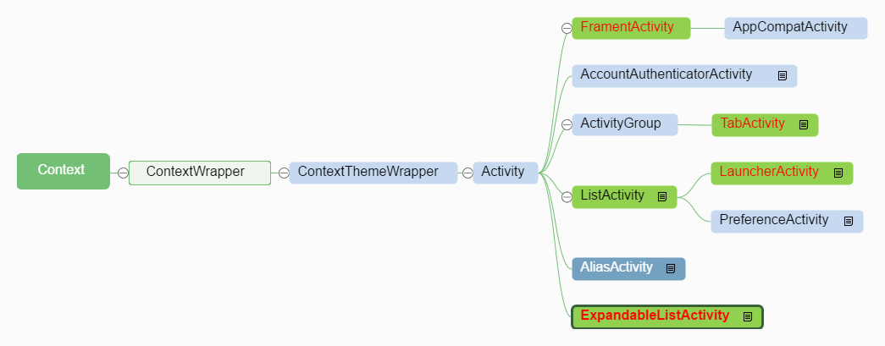
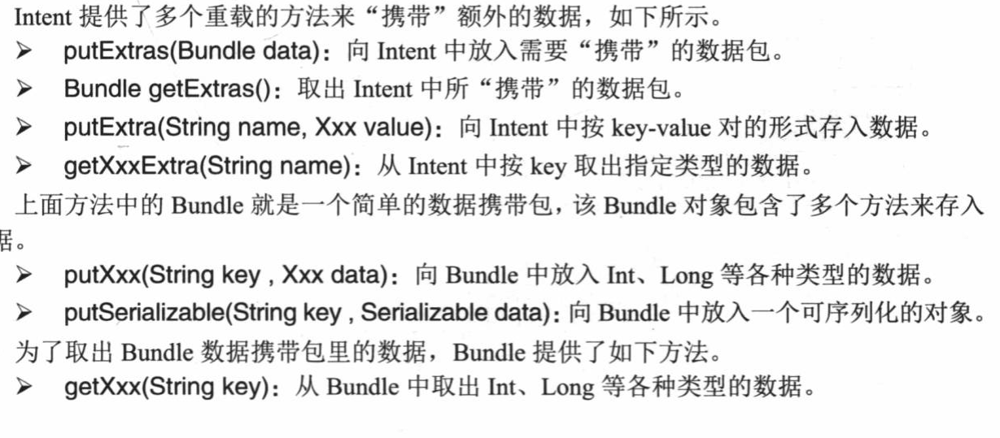
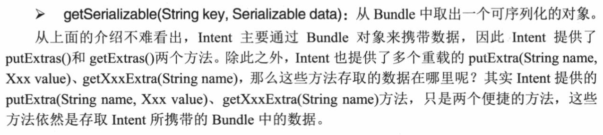

## Android 实验四-深入理解 Activity
### 1. Activity 类的 继承关系


### 2. `LauncherActivity` 和`ExpandableActivity` 示例
####`LauncherActivity`  对每一个列表项，都对应着一个 `Intent` ，当用户单击该`Intent` 后，就会启动对应的 `Activity` 

 继承 `LauncherActivity` ，重写 `intentForPosition` 方法，为当前`Activity` 设置 适配器
```
public class MainActivity extends LauncherActivity {

    String[] names ={"设置程序参数","查看星际兵种"};
    //定义两个Activity 的实现类
    Class<?>[] clazzs ={PreferenceActivityTest.class, ExpandableActivityTest.class};
    @Override
    protected void onCreate(Bundle savedInstanceState) {
        super.onCreate(savedInstanceState);
        // 创建适配器对象
        ArrayAdapter<String> adapter = new ArrayAdapter<>(this,android.R.layout.simple_list_item_1,names);
        // 设置当前activity 显示的 adapter
        setListAdapter(adapter);
    }

    // 对每一个列表项，都要创建并返回一个 Intent对象 
    @Override
    protected Intent intentForPosition(int position) {
        return new Intent(MainActivity.this,clazzs[position]);
    }
}
```
#### `ExpandableListActivity`能够实现可展开的列表项
继承 `ExpandableListActivity`，创建 `BaseExpandableListAdapter`（抽象类）子类对象，实现其抽象方法

```
public class ExpandableActivityTest extends ExpandableListActivity {
    int[] logos={
            R.drawable.a,
            R.drawable.b,
            R.drawable.c,
            R.drawable.d
    };

    String [] items ={"水果","蔬菜","动物"};
    String [][] subItems ={
            {"香蕉","梨子","苹果"},
            {"白菜","青菜"},
            {"蛇","狗","猪","猫"}
   };
    @Override
    protected void onCreate(Bundle savedInstanceState) {
        super.onCreate(savedInstanceState);

        // 创建当前 activity 的 adapter 对象
        ExpandableListAdapter adapter = new BaseExpandableListAdapter() {
            @Override
            public int getGroupCount() {
                return items.length;
            }

            @Override
            public int getChildrenCount(int groupPosition) {
                return subItems[groupPosition].length;
            }

            @Override
            public Object getGroup(int groupPosition) {
                return items[groupPosition];
            }

            @Override
            public Object getChild(int groupPosition, int childPosition) {
                return subItems[groupPosition][childPosition];
            }

            @Override
            public long getGroupId(int groupPosition) {
                return groupPosition;
            }

            @Override
            public long getChildId(int groupPosition, int childPosition) {
                return childPosition;
            }

            @Override
            public boolean hasStableIds() {
                return true;
            }

            // 设置每一组数据的 外观
            @Override
            public View getGroupView(int groupPosition, boolean isExpanded, View convertView, ViewGroup parent) {
                LinearLayout ll = new LinearLayout(ExpandableActivityTest.this);
                ll.setOrientation(LinearLayout.HORIZONTAL);
                ImageView imageView = new ImageView(ExpandableActivityTest.this);
                imageView.setImageResource(logos[groupPosition]);
                imageView.setScaleType(ImageView.ScaleType.CENTER_CROP);

                AbsListView.LayoutParams lp = new AbsListView.LayoutParams(100,100);
                imageView.setLayoutParams(lp);

                TextView textView = getTextView();
                textView.setText(getGroup(groupPosition).toString());

                ll.addView(imageView);
                ll.addView(textView);
                return ll;
            }
            //该方法决定每个子选项的外观
            @Override
            public View getChildView(int groupPosition, int childPosition, boolean isLastChild, View convertView, ViewGroup parent) {
                TextView textView = getTextView();
                textView.setText(getChild(groupPosition,childPosition).toString());
                return textView;
            }

            //判断子选项是否被选中
            @Override
            public boolean isChildSelectable(int groupPosition, int childPosition) {
                return true;
            }


            private TextView getTextView(){
                // 创建ViewGroup.LayoutParams 子类对象
                AbsListView.LayoutParams lp = new AbsListView.LayoutParams(ViewGroup.LayoutParams.MATCH_PARENT,64);
                // 创建TextView 对象
                TextView textView= new TextView(ExpandableActivityTest.this);
                // 将 LayoutParams 参数传入
                textView.setLayoutParams(lp);
                textView.setGravity(Gravity.CENTER|Gravity.LEFT);
                textView.setTextSize(20);
                return textView;
            }
        };
        setListAdapter(adapter);
    }
}
```

### 3. `PreferenceActivity`的使用
当进行选项设置，保存选项结果时以参数的 形式保存，用`Preferences` 类来进行保存

如果某个`Activity` 专门只用于设置选项参数，则 继承 `PreferenceActivity`
1. `PreferenceActivity` 不使用普通的界面布局文件，而是使用**选项设置的布局文件**。
2. 优化： `PreferenceActivity` 和 `PreferenceFragment`结合使用
 - `PreferenceActivity` 加载**选项设置列表**的布局文件
 - `PreferenceFragment`加载**选项设置**的布局文件

**选项设置列表**的布局文件，以`preference-headers`为根元素，子标签header 用于指定启动 `PreferenceFragment`的列表项, 或者指定使用 `Intent` 启动 指定 `Activity` 的列表项

```
android:fragment="com.example.ethanwalker.activitydemo.PreferenceActivityTest$Prefs1Fragment" 表示启动的是ActivityTest 类中的 内部类Prefs1Fragment
```

```
preference_headers.xml

<preference-headers xmlns:android="http://schemas.android.com/apk/res/android">
    <!-- 指定启动指定PreferenceFragment 的列表项 -->
    <header
        android:fragment="com.example.ethanwalker.activitydemo.PreferenceActivityTest$Prefs1Fragment"
        android:icon="@drawable/ic_settings_applications"
        android:summary="设置应用的相关选项"
        android:title="程序选项设置" />
        
    <header android:fragment="com.example.ethanwalker.activitydemo.PreferenceActivityTest$Prefs2Fragment"
        android:icon="@drawable/ic_settings_display"
        android:summary="设置显示界面的相关选项"
        android:title="界面选项设置">
        <!-- 使用extra 可向 Activity 传入额外的数据 -->
        <extra
            android:name="website"
            android:value="www.crazyit.org" />
    </header>

    <!--  使用Intent 启动指定 Activity 的列表项 -->
    <header
        android:icon="@drawable/ic_settings_display"
        android:summary="使用Intent启动某个Activity"
        android:title="使用Intent">
        <intent
            android:action="android.intent.action.VIEW"
            android:data="http://www/crazyit.org" />
    </header>
</preference-headers> 
```

**选项设置**的布局文件以 `PreferenceScreen` 作为根元素-- 表明定义一个选项设置的界面布局。

```
preferences.xml

<PreferenceScreen xmlns:android="http://schemas.android.com/apk/res/android">
    <!-- 设置系统铃声 -->
    <RingtonePreference
        android:key="ring_key"
        android:summary="选择铃声(测试RingtonePreference)"
        android:title="设置铃声"></RingtonePreference />
        
    <PreferenceCategory android:title="个人信息设置组">
        <!-- 通过输入框填写用户名 -->
        <EditTextPreference />
        <!-- 通过选择框选择性别 -->
        <ListPreference
            android:dialogTitle="选择性别"
            android:entries="@array/gender_name_list"
            android:entryValues="@array/gender_value_list"
            android:key="gender"
            android:summary="选择您的性别(测试ListPreference)"
            android:title="性别"></ListPreference>
        <!--entries  表示在屏幕上显示的内容（键），entryValues 表示实际保存到后台中的内容（值）,数组内容保存在 res/values/array 中的 <string-array>标签内  -->

    </PreferenceCategory>
    
    <PreferenceCategory android:title="系统功能设置组">
        <CheckBoxPreference
            android:defaultValue="true"
            android:key="autoSave"
            android:summaryOff="自动保存：关闭"   
            android:summaryOn="自动保存：开启"
            android:title="自动保存进度">
        </CheckBoxPreference>
                <!-- summaryOn="value" 表示当选中该 复选框时，显示的summary内容是 value-->

    </PreferenceCategory>
</PreferenceScreen>
```

3.  继承`PreferenceActivity`，加载 **选项设置列表** 布局文件，同时 创建内部类 继承 `PreferenceFragment`，在内部类中加载 **选项设置**布局文件  
```
PreferenceActivityTest.java

// 选项设置列表 界面，适用于整个Activity 都用于选项设置
public class PreferenceActivityTest extends PreferenceActivity {

    @Override
    protected void onCreate(Bundle savedInstanceState) {
        super.onCreate(savedInstanceState);

        //为该界面设置一个标题按钮
        if (hasHeaders()) {
            Button button = new Button(this);
            button.setText("设置操作");
            //将该按钮添加到该界面上
            setListFooter(button);
        }
    }
    //Called when the activity needs its list of headers build.
    @Override
    public void onBuildHeaders(List<Header> target) {
        //加载 选项设置列表 中的布局文件
        loadHeadersFromResource(R.xml.preference_headers, target);
    }

    //验证各PreferenceFragment 是否有效
    @Override
    protected boolean isValidFragment(String fragmentName) {
        return true;
    }

    // 下面两个PreferenceFragment 子类 分别用于加载
    // preferences.xml 和 display_prefs 两个选项设置的布局文件

    public static class Prefs1Fragment extends PreferenceFragment {
        @Override
        public void onCreate(@Nullable Bundle savedInstanceState) {
            super.onCreate(savedInstanceState);
            // 为当前PreferenceFragment 添加 选项设置 布局文件
            addPreferencesFromResource(R.xml.preferences);
        }
    }
    public static class Prefs2Fragment extends PreferenceFragment {
        @Override
        public void onCreate(@Nullable Bundle savedInstanceState) {
            super.onCreate(savedInstanceState);
            addPreferencesFromResource(R.xml.display_prefs);
            // 在布局文件中Extra 标签中设置的参数， 获取传入该 PreferenceFragment 对象 的参数
            String website = getArguments().getString("website");
            Toast.makeText(getActivity(), "网站域名是：" + website, Toast.LENGTH_LONG).show();
        }
    }
}
```


### 4. 使用`Bundle` 在 `Activity` 之间传送数据
#### （1）被启动的 Activity 获取 源 Activity 中的 数据




**发送方**
```
Student已实现 Serializable 接口

 Student s = new Student(user,pwd,gender);
                // 创建Bundle对象，并通过 putSerializable 将序列化对象放入
                Bundle bundle = new Bundle();
                bundle.putSerializable("person",s);

                Intent intent = new Intent(RegisterWindow.this,DisplayMessage.class);
                intent.putExtras(bundle);
                
                startActivity(intent);
               
```

**接收方**

```
    Intent intent = getIntent();
    Student s = (Student)(intent.getSerializable("person"));// 后台调用的是 Bundle 对象的 getSerializable（key） 方法
```

#### （2）源Activity 获取被启动的 Activity 返回的数据

**源Activity :** 
1.  `startActivityForResult(intent,requestCode);` 启动其他的 `activity`，并用`requestCode` 标识该 `activity`（可能在源`Activity` 中启动多个`Activity`，`requestCode` 用来标识 哪个`Activity` 返回的内容）

2. 重写 `onActivityResult(int requestCode, int resultCode, Intent data)`，该方法在每次被启动的 `Activity` 返回结果时调用， 根据返回的 `requestCode` 判断是哪个 `activity` ，通过 `data` 获取 数据

**被启动 Activity：**
1. `getIntent()` 获取 传入 的`Intent` 对象，将数据放入`Intent` 对象中，调用该`Activity` 中的 `setResult(requestCode, intent)`， 返回给源`Activity` 数据

`StartActivity.java`
```
      selectCity.setOnClickListener(new View.OnClickListener() {
            @Override
            public void onClick(View v) {
                Intent intent = new Intent(StartActivity.this,ExpanableCity.class);
                startActivityForResult(intent,0);
            }
        });
        inputName.setOnClickListener(new View.OnClickListener() {
            @Override
            public void onClick(View v) {
                Intent intent = new Intent(StartActivity.this,InputName.class);
                startActivityForResult(intent,1);
            }
        });
    }

    @Override
    protected void onActivityResult(int requestCode, int resultCode, Intent data) {
        switch (requestCode){
            case 0:
                city.setText(data.getStringExtra("city"));
                break;
            case 1:
                name.setText(data.getStringExtra("name"));
                break;
```

```
被启动Activity：
 submit.setOnClickListener(new View.OnClickListener() {
            @Override
            public void onClick(View v) {
                Intent intent = getIntent();
                String name = enterName.getText().toString();
                intent.putExtra("name",name);
                InputName.this.setResult(0,intent);
                InputName.this.finish();
            }
        });
```

当被启动的 Activity 是 `ExpandableActivity` 子类，或者其他列表Activity 时，是通过 点击选择 数据，此时不能通过 控件输入数据来 获取数据，
通过下面方法设置点击选项的响应事件
```
getExpandableListView().setOnChildClickListener(new ExpandableListView.OnChildClickListener() {
    @Override
    public boolean onChildClick(ExpandableListView parent, View v, int groupPosition, int childPosition, long id) {
        Intent intent = getIntent();
        intent.putExtra("city",city[groupPosition][childPosition]);
        ExpanableCity.this.setResult(0,intent);
        ExpanableCity.this.finish();
        return false;
    }
    });
```

### 5. Activity 的回调机制
当Activity 被部署在Android应用之中，随着应用程序的运行，Activity会不断地在不同的状态之间切换，根据不同的状态，Activity 中对应的方法就会被回调。

### 6. Activity 的生命周期和 4种加载模式
#### 生命周期
 **运行、暂停、停止、销毁**
####  加载模式
设置加载模式：
在`AndroidManifest.xml`对应的 activity 中，添加 属性 `android:launchMode ="standard/singleTop/singleTask/singleInstance"`

1. standard 
每次启动都会创建该Activity 的实例对象，并放入 活动栈中
2. singleTop 
如果要启动的活动在栈顶，就直接使用，而不再创建活动对象；
不在栈顶，创建Activity 的实例对象压入栈中	
3. singleTask
如果要启动的活动在 栈中（不是栈顶），则将该活动之上的活动依次从栈中移除	
4. singleInstance 
设置为singleInstance 的活动在第一次启动时，会为其创建一个新的栈，并将该 活动置于栈顶，当其他程序启动进入该活动时，不再创建实例