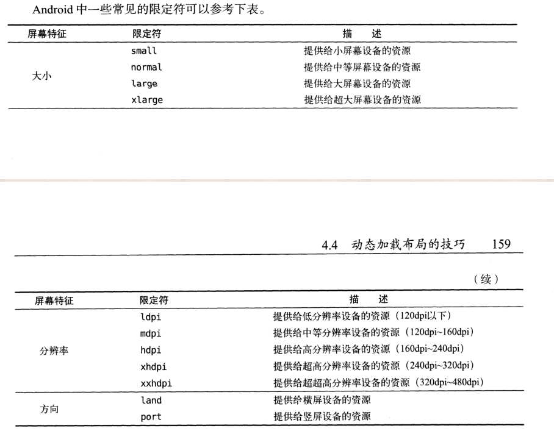

## 奇淫技巧
1. 当启动某个 activity 需要传入若干参数时，将启动方法定义在被启动的activity内

	好处：例如A 启动 B , A不知道应该传入多少个参数，故可在B中定义一个静态方法，
		  A直接调用B的actionStart方法，传入A的context对象以及方法中需要的参数即可

	```
	public static void actionStart(Context context, String title,String content){
        Intent intent = new Intent(context,NewsContentActivity.class);
        intent.putExtra("title",title);
        intent.putExtra("content",content);
        context.startActivity(intent);
    }
    ```
2. Fragment 内容的切换:
	frag1，frag2 同时在一个activity中，如果希望在 frag1中的某个操作，使得frag2 中的某些内容被改变，可在 frag2内定义一个 切换的方法，如 refresh,需要调用者传入切换内容的参数

	例如：
	frag2: NewsContentFrag.java
	```
	public void refresh(String title,String content){
        titleView.setText(title);
        contentView.setText(content);
    }
    ```
   frag1：NewsListFrag
   ```
   NewsContentFrag newsContentFrag = (NewsContentFrag) getActivity().getSupportFragmentManager().findFragmentById(R.id.large_news_content_frag);
   newsContentFrag.refresh(news.getTitle(), news.getContent());
   ```
3. 适配平板和手机
   手机（小屏幕）一般会直接调用 layout 内的布局文件，但为了适配平板，需要创建layout-large,或者layout-sw600dp 布局文件夹

   -large能起作用的地方，-swXXdp也都可以，而且-swXXdp能提供更细的划分。 （译者注：-large的范围划分比较粗，而用-swXXdp可以更细分范围，更好的满足需求）。

	那么究竟应该如何使用sw或者w限定符呢？下面给出几个例子，你们感受一下：

	7寸平板：不要再使用layout-large，使用layout-sw600dp。

	说明：Nexus 7 = 960 X 600 dp；最小的尺寸是600。

	10寸平板：不要再使用layout-xlarge，使用layout-sw720dp。

4.  View可作为分割线，

	```
	<View
    android:layout_width="match_parent"
    android:layout_height="1dp"
    android:background="#000" />
	```


